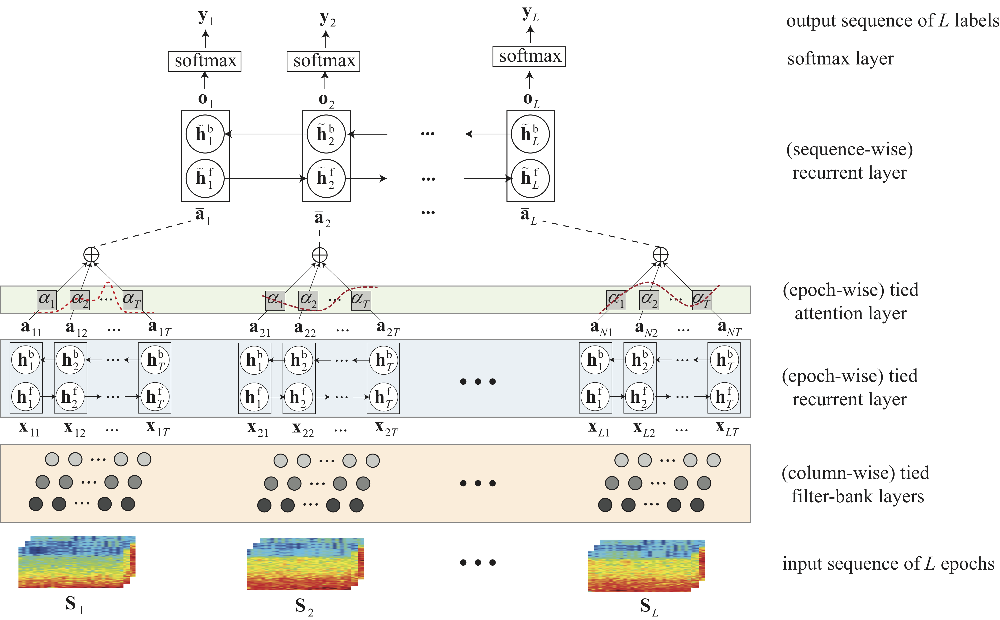
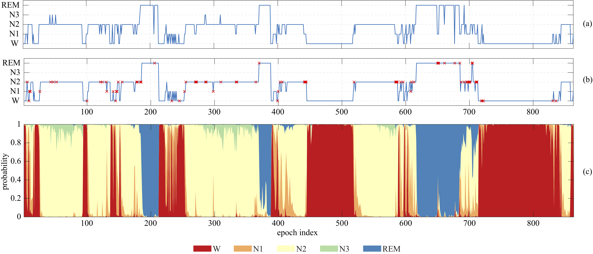

# SeqSleepNet
- Huy Phan, Fernando Andreotti, Navin Cooray, Oliver Y. Chén, and Maarten De Vos. [__SeqSleepNet: End-to-End Hierarchical Recurrent Neural Network for Sequence-to-Sequence Automatic Sleep Staging.__](https://arxiv.org/pdf/1809.10932) _IEEE Transactions on Neural Systems and Rehabilitation Engineering (TNSRE)_, vol. 27, no. 3, pp. 400-410, 2019 *(Highlighted in the publish issue: [Link](https://ieeexplore.ieee.org/stamp/stamp.jsp?tp=&arnumber=8672791))*

These are source code and experimental setup for the __MASS database__, used in our above arXiv preprint. Although the networks have many things in common, we try to separate them and to make them work independently to ease exploring them invididually.

Currently, _SeqSleepNet_ and two baselines _E2E-ARNN_ and _Multitask E2E-ARNN_ are available (_E2E-DeepSleepNet_ baseline is still missing, we will clean it up and make it available shortly). Output of t nheetworks are also included, so that you can re-produce the results with the evaluation scripts. However, you can repeat the experiments following the steps below. 

How to run:
-------------
1. Download the database
- __MASS database__ is available [here](https://massdb.herokuapp.com/en/). Information on how to obtain it can be found therein.
2. Data preparation
- Change directory to `./data_processing/`
- Run `main_run.m`
3. Network training and testing
- Change directory to a specific network in `./tensorflow_net/`, for example `./tensorflow_net/SeqSleepNet/`
- Run a bash script, e.g. `bash run_seq20.sh`, to repeat 20 cross-validation folds.  
4. Evaluation
- Execute a specific evaluation Matlab script, for example `eval_seqsleepnet.m`

An example:
-------------
__Matlab files of the used database can be requested but it's best to request for the orignial MASS database. So far, many told that requests for the database were not responded/took so long. I'd suggest to be patient.__

In order to give an idea about the data structure and how to run the networks, I have added a small example 

1. Matlab files and data list of the example stored in `./example_data/`
2. Network training and testing
- Change directory to a specific network in `./tensorflow_net/`, for example `./tensorflow_net/SeqSleepNet/`
- Run a bash script, e.g. `run_example_seq10_3chan.sh`, to train and test SeqSleepNet-10 with the example data.  

Environment:
-------------
- Matlab v7.3 (for data preparation)
- Python3
- Tensorflow GPU 1.x (x >= 3) (for network training and evaluation)

Some results:
-------------
Sleep scoring with _SeqSleepNet_ for one subject of MASS databaset:

Illustration of attention weights learned by _SeqSleepNet_ on five epochs of different sleep stages:

Contact:
-------------
Huy Phan 

School of Electronic Engineering and Computer Science  
Queen Mary University of London
Email: h.phan{at}qmul.ac.uk

License
-------------
MIT © Huy Phan
